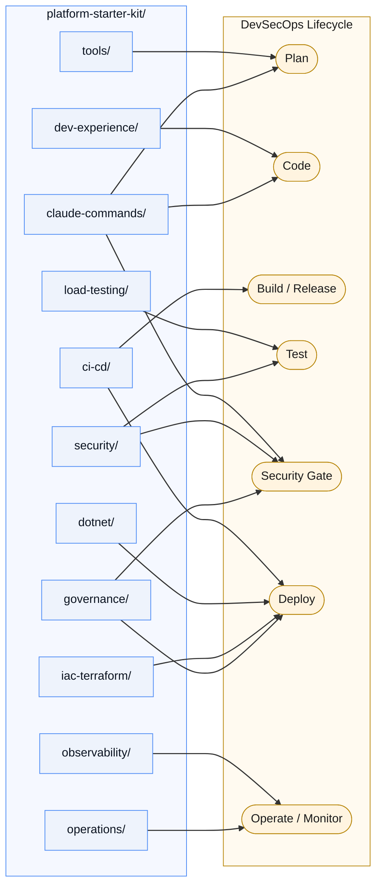

# platform-starter-kit

[](https://github.com/jaricsng/platform-starter-kit/actions/workflows/validate-kit.yml)
[](LICENSE)

A golden-path starter kit for DevSecOps platform engineering: pre-commit
security baseline, CI/CD pipeline shape, observability stack, load-testing
scenarios, a Terraform module, OWASP pen-test scripts, and a library of
Claude Code commands — extracted from a working three-tier reference
application and organized by **capability** so you can take only what you
need.

## Use this template

Fastest path — clone this repo, then scaffold a new repo from it with the
app-name placeholders already resolved:

```bash
git clone https://github.com/jaricsng/platform-starter-kit.git
python3 platform-starter-kit/tools/scaffold.py \
  --app-name my-service --output ../my-service --cloud gcp
cd ../my-service && python3 tools/doctor.py .
```

Or click **"Use this template"** on GitHub for a clean copy with no shared
git history, then follow [`docs/GETTING-STARTED.md`](docs/GETTING-STARTED.md)
and copy/edit folders by hand. A plain `git clone` works too if you just
want to read through it first.

Before adopting, check [`docs/ARCHITECTURE-FIT.md`](docs/ARCHITECTURE-FIT.md)
— this kit assumes a specific shape (containerized HTTP services on a
managed container platform, OpenTelemetry instrumented). If your project
doesn't match, that doc tells you what to fix first and what to take
à la carte instead.

Start with `examples/minimal-service/` — it boots every extracted piece
together (CI shape excluded — that runs on GitHub, not locally) so you can
see it work before touching your own code.

## Capability map



## What's in here

| Folder | What it is |
|---|---|
| `tools/` | `scaffold.py` — generates a new repo from this kit with app-name placeholders pre-resolved and a `catalog-info.yaml` already in place; `doctor.py` — automates `docs/ARCHITECTURE-FIT.md`'s pre-adoption readiness checklist; `sync_check.py` — reports what's changed upstream since you scaffolded; `check_migrations.py` — flags backward-incompatible schema changes |
| `dev-experience/` | The paved inner loop: a `Makefile` task interface (`make test`/`run`/`lint`/`doctor`/`obs-up`), a `.devcontainer`, `.tool-versions`, and `.env.example` — copied to repo root so local and CI run the same commands |
| `claude-commands/` | 19 Claude Code slash commands — coding standards, security review, compliance, performance/pen testing, cloud config review |
| `dotnet/` | .NET Aspire `ServiceDefaults` (OTel/health-check wiring) + an `AppHost` template for orchestrating multi-service apps |
| `ci-cd/` | GitHub Actions CI/CD pipeline shape (lint → test → security → build → Trivy gate → SBOM → SLSA provenance → staged deploy) and a pre-commit security baseline |
| `observability/` | Jaeger + Prometheus + Grafana, provisioned and pre-wired as a Docker Compose overlay |
| `load-testing/` | k6 (smoke/load/spike) and Locust scenarios with worked-example patterns (token pools, staged ramps, weighted user mixes) |
| `iac-terraform/` | A parameterized GCP Cloud Run + Cloud SQL + Secret Manager Terraform module |
| `security/` | An OWASP Top 10 manual pen-test script and an OWASP ZAP scan wrapper |
| `governance/` | Conftest/OPA policy-as-code guardrails (OSS baseline) for the Terraform module, plus `tools/doctor.py`'s CI-enforced readiness gate and branch-protection guidance — see `docs/GETTING-STARTED.md`'s governance step |
| `operations/` | Day-2 runbooks (rollback, incident response, postmortem template) and SLO definitions tied to the observability stack's alerts — the human procedures behind the signals |
| `examples/minimal-service/` | A throwaway FastAPI app proving everything above works together |

See [`docs/ASSET-CATALOG.md`](docs/ASSET-CATALOG.md) for a per-asset
reusability rating and source provenance,
[`docs/TODO.md`](docs/TODO.md) for every placeholder you need to fill in,
[`docs/ENTERPRISE-TOOLING.md`](docs/ENTERPRISE-TOOLING.md) for how each
piece maps to an enterprise-grade replacement as you outgrow the
free/OSS default, and
[`docs/TECH-STACK-SWAP-GUIDE.md`](docs/TECH-STACK-SWAP-GUIDE.md) for the
file-by-file mechanics of swapping any piece (language/runtime, CI
platform, database, IaC tool, observability stack) for a different one,
[`docs/DATABASE-MIGRATIONS.md`](docs/DATABASE-MIGRATIONS.md) for the
expand/contract pattern the migration-safety gate enforces, and
[`docs/FEATURE-FLAGS.md`](docs/FEATURE-FLAGS.md) for decoupling deploy
from release so shipping to production stays boring.

## Versioning

Tagged with semver:
- **major** — breaking layout change (a folder moves or is removed)
- **minor** — a new capability folder is added
- **patch** — documentation or template fixes with no structural change

See [`CHANGELOG.md`](CHANGELOG.md) for release history.

## License

MIT — see [`LICENSE`](LICENSE).
