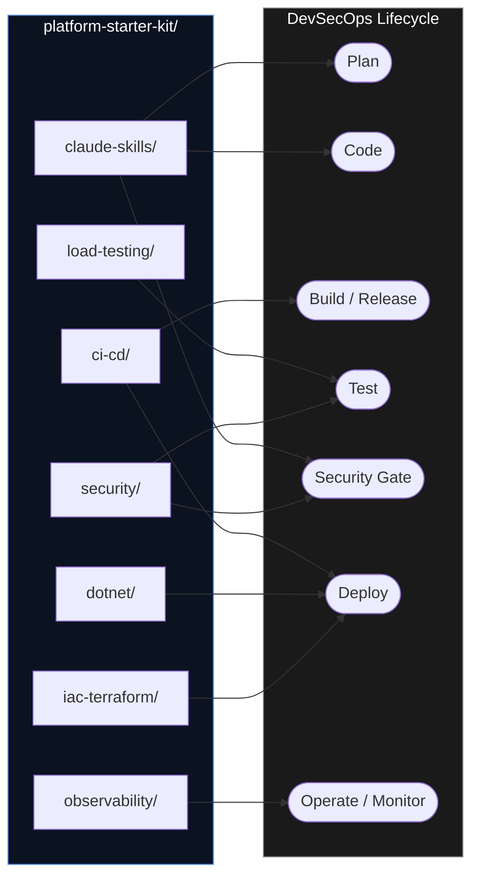

# platform-starter-kit

A golden-path starter kit for DevSecOps platform engineering: pre-commit
security baseline, CI/CD pipeline shape, observability stack, load-testing
scenarios, a Terraform module, OWASP pen-test scripts, and a library of
Claude Code skills — extracted from a working three-tier reference
application and organized by **capability** so you can take only what you
need.

## Use this template

This repo is a GitHub template repository. Click **"Use this template"** on
GitHub to get a clean copy with no shared git history, then follow
[`docs/GETTING-STARTED.md`](docs/GETTING-STARTED.md). If you just want to
read through it first, a plain `git clone` works too.

Start with `examples/minimal-service/` — it boots every extracted piece
together (CI shape excluded — that runs on GitHub, not locally) so you can
see it work before touching your own code.

## Capability map

## What's in here

| Folder | What it is |
|---|---|
| `claude-skills/` | 19 Claude Code skill prompts — coding standards, security review, compliance, performance/pen testing, cloud config review |
| `dotnet/` | .NET Aspire `ServiceDefaults` (OTel/health-check wiring) + an `AppHost` template for orchestrating multi-service apps |
| `ci-cd/` | GitHub Actions CI/CD pipeline shape (lint → test → security → build → Trivy gate → SBOM → SLSA provenance → staged deploy) and a pre-commit security baseline |
| `observability/` | Jaeger + Prometheus + Grafana, provisioned and pre-wired as a Docker Compose overlay |
| `load-testing/` | k6 (smoke/load/spike) and Locust scenarios with worked-example patterns (token pools, staged ramps, weighted user mixes) |
| `iac-terraform/` | A parameterized GCP Cloud Run + Cloud SQL + Secret Manager Terraform module |
| `security/` | An OWASP Top 10 manual pen-test script and an OWASP ZAP scan wrapper |
| `examples/minimal-service/` | A throwaway FastAPI app proving everything above works together |

See [`docs/ASSET-CATALOG.md`](docs/ASSET-CATALOG.md) for a per-asset
reusability rating and source provenance, and
[`docs/TODO.md`](docs/TODO.md) for every placeholder you need to fill in.

## Versioning

Tagged with semver:
- **major** — breaking layout change (a folder moves or is removed)
- **minor** — a new capability folder is added
- **patch** — documentation or template fixes with no structural change

See [`CHANGELOG.md`](CHANGELOG.md) for release history.

## License

MIT — see [`LICENSE`](LICENSE).
