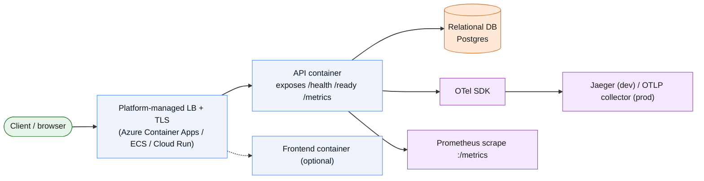

# Architecture Fit

Every asset in this kit bakes in assumptions about the shape of the project
that adopts it. This doc makes those assumptions explicit so you can check
fit *before* copying folders in, and tells you what to fix first if your
project doesn't match.

## The architecture this kit assumes

- **1–3 long-running HTTP services per repo** (an API, optionally a
  frontend, talking to one relational database) — not a fleet of a dozen
  microservices.
- **Synchronous REST**, not event-driven. There's no message-broker
  observability, load-test pattern, or CI job anywhere in the kit.
- **Containers on a managed "serverless container" platform** — Azure
  Container Apps, AWS ECS Fargate, or GCP Cloud Run. The platform terminates
  TLS and load-balances for you. There are no Kubernetes manifests, Helm
  charts, or service-mesh config in this kit. Local multi-service
  orchestration uses .NET Aspire's AppHost (see `dotnet/`).
- **OpenTelemetry SDK in-process**, exporting OTLP to Jaeger locally and to
  an OTLP endpoint in prod (see `examples/minimal-service/telemetry.py`
  and `dotnet/ServiceDefaults/Extensions.cs` — same pattern, two
  languages).
- **A `GET /health` (liveness) and `GET /ready` (readiness) endpoint**,
  checked by every CI smoke job, every deploy job's post-deploy check, and
  the observability stack's implicit expectations.
- **GitHub Actions + GHCR** as the build/registry layer, with the
  build-once/promote-the-same-artifact pattern between staging and
  production.

## Good fit

- A small team shipping one or a handful of containerized services
  (FastAPI/Express/ASP.NET-style API ± an SPA) without a dedicated platform
  team or existing Kubernetes cluster.
- Greenfield or early-stage products that haven't picked a cloud yet — the
  four deploy jobs in `publish.yml` let you defer that choice.
- Teams that want a security/observability baseline (Trivy gate, SBOM,
  SLSA provenance, OTel tracing) without building it from scratch.

## Poor fit — adapt heavily or look elsewhere first

| Your architecture | Why this kit doesn't fit as-is | What to use instead / adapt |
|---|---|---|
| Kubernetes (EKS/GKE/AKS), service mesh | No Helm/Kustomize/manifests/Argo CD here — only `iac-terraform/gcp-cloud-run`, which is Cloud Run-specific | Keep `observability/`, `ci-cd/pre-commit/`, and `claude-commands/security-*` (those are platform-agnostic); replace the deploy layer entirely |
| Serverless FaaS (Lambda zip, Cloud Functions, Azure Functions) | The whole kit assumes a long-running process with `/health`/`/ready` — function invocations don't have that lifecycle | Keep the security/CI scanning jobs; drop the health-check and observability-overlay assumptions |
| Event-driven / async (Kafka, SQS, Pub/Sub, RabbitMQ) | No broker observability, no async load-test pattern, no message-contract testing | Use the kit for any synchronous HTTP surface you still have; build messaging observability separately |
| 10+ service microservices fleet | Sized for 1–3 services per repo; no multi-repo orchestration, internal dev portal, or service-mesh tracing context propagation | Fine as a per-service template repeated per repo, but you'll want a platform layer on top (e.g. Backstage) this kit doesn't provide |
| Batch/data pipeline, ML training jobs | No scheduler, no batch-job CI gate, load-testing assets assume HTTP | Not a fit — this is a request/response web-service kit |
| Static frontend / JAMstack with no backend | Observability and CI assumptions revolve around a backend exposing `/health` | Use `ci-cd/pre-commit` and `claude-commands/check-frontend.md` only |

## Pre-adoption checklist: signals your project is outside this baseline

Before copying a capability folder in, check whether your project already
matches what that folder assumes. If it doesn't, the table below is the
action to take *first* — copying the asset before fixing the gap usually
produces a CI pipeline or dashboard that silently fails or shows nothing.

Run `python3 tools/doctor.py /path/to/your/repo` to check most of these
signals automatically instead of self-assessing by eye — it's the same
checklist below, scripted (plus it's what `tools/scaffold.py` tells you to
run right after generating a new repo).

| Signal in your project | Risk if you adopt anyway | Action to take first |
|---|---|---|
| No `Dockerfile` / not containerized | `ci-cd/*`, `observability/*`, and all four deploy jobs assume a container image | Containerize the service before touching CI or deploy templates |
| No `/health` or `/ready` endpoint | Every smoke test, E2E gate, and deploy job's post-deploy check polls these and will fail closed | Add both endpoints (see `dotnet/ServiceDefaults/Extensions.cs` or `examples/minimal-service/telemetry.py` for the two reference shapes) before wiring CI |
| No OpenTelemetry instrumentation | `observability/docker-compose.observability.yml` and the Grafana dashboard will show empty panels — not an error, just silence, which is harder to debug than a failure | Instrument first (or accept the dashboard will be empty until you do — don't spend time debugging "broken" Grafana panels that are actually just unfed) |
| Secrets currently committed in `.env` / source | `ci-cd/pre-commit/.pre-commit-config.yaml`'s secret-detection hook and `claude-commands/check-secrets.md` will immediately flag your existing history | Rotate every exposed secret and scrub git history (e.g. `git filter-repo`) *before* enabling the pre-commit baseline — otherwise the first commit under the new hook is a wall of pre-existing findings that trains the team to ignore the hook |
| Already running on Kubernetes | The deploy jobs in `publish.yml` (ACA/ECS/Cloud Run) don't apply; `iac-terraform/gcp-cloud-run` doesn't apply | Take only `ci-cd/pre-commit`, the `security` and `terraform-plan`-minus-Cloud-Run-specifics jobs from `ci.yml`, `observability/`, and `claude-commands/*`; skip `publish.yml` and the Terraform module entirely |
| No automated tests at all | `ci.yml`'s `backend`/`frontend` jobs assume `pytest`/`npm test` exist and fail the build if they don't | Add a minimal test suite (even one smoke test) before copying `ci.yml`, or strip the test step and add it back incrementally |
| Single shared environment (no staging) | `publish.yml`'s staging→production promotion and the ZAP baseline scan job both require a `staging` GitHub Environment to target | Stand up a staging environment, or delete the staging job and point the production job directly at your one environment (loses the safety net of testing the artifact before prod) |
| No relational database, or non-relational (Mongo, DynamoDB) | `ci.yml`'s `backend` job spins up Postgres as a CI service container; `claude-commands/check-db.md` checks SQLAlchemy/Alembic conventions | Replace the CI service container and swap `check-db.md`'s checks for your datastore's actual conventions — don't leave a Postgres service container running idle in CI |
| Metric names already chosen and don't match OTel semconv | `observability/recording_rules.yml` and the Grafana dashboard query specific metric names (and the two files already disagree with each other internally — see `docs/ASSET-CATALOG.md`) | Pick one semantic-convention version, fix the kit's internal mismatch, **then** align your service's metric names to match before wiring the dashboard |

## If none of the above match

If your project is fundamentally a different shape (Kubernetes-native,
serverless FaaS, event-driven, or a large microservices fleet), don't
force-fit this kit wholesale. The platform-agnostic pieces — pre-commit
security baseline, the `claude-commands/*` library, and the OWASP
pen-test/ZAP scripts in `security/` — are still worth taking individually.
Everything else (`ci-cd/github-actions/*`, `iac-terraform/`, the
observability Compose overlay) is written for the containerized,
synchronous-HTTP, serverless-container architecture described above and
will need a different deploy/orchestration layer underneath it.
