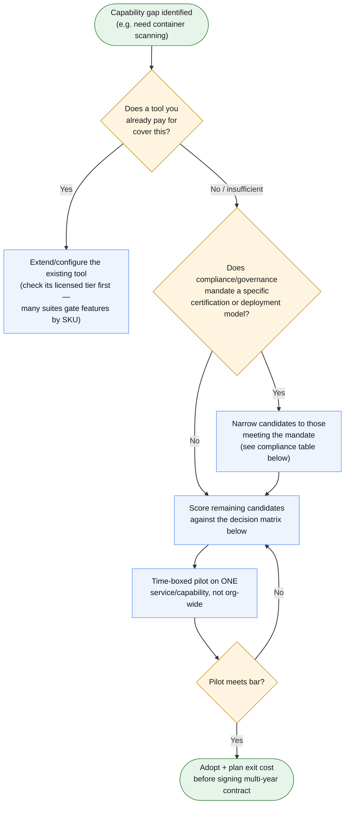

# Enterprise Tooling Guide

This kit ships with free/open-source tools wired together end-to-end —
good enough to run the full DevSecOps lifecycle from day one, with no
procurement. As a team scales (more services, more compliance scope, more
auditors), individual stages outgrow the OSS tool and need an enterprise
replacement. This doc maps **what's in the kit today** to **what to
replace it with**, and **exactly what setup work that replacement
requires** — referencing the actual files you'd touch.

One thing that makes swaps cheaper than they look: the kit's
instrumentation layer is already vendor-neutral. Telemetry goes through
**OpenTelemetry** (OTLP), not a vendor SDK; cloud auth goes through
**OIDC** (keyless), not long-lived credentials; container scan results go
through **SARIF**, a format every major SAST/DAST vendor's GitHub Action
also emits. Swapping the *backend* behind those interfaces is usually a
config change, not a rewrite.

> **The vendor names below are research anchors, not a procurement
> recommendation.** They illustrate the category and rough swap effort.
> Certifications, regions, pricing models, and feature sets change faster
> than this doc will be updated — verify directly with the vendor, and run
> every candidate through the [decision framework](#choosing-the-right-tool-for-your-requirements)
> below before shortlisting. The tool that's "best" in a vendor comparison
> article is frequently the wrong choice once your existing contracts,
> compliance scope, and team's operating capacity are accounted for.

## Stack by lifecycle stage

### Plan

| In the kit today | Enterprise option | What adoption requires |
|---|---|---|
| `claude-commands/threat-model.md`, `review-conventions.md` (ad hoc, in-repo) | **Jira/Azure Boards + IriusRisk or ThreatModeler** (formal threat-model registry); **OWASP Threat Dragon** if you want to stay open-source | Procure/license; train architects on STRIDE; add a "threat model required" checkbox to `.github/PULL_REQUEST_TEMPLATE.md` gating high-risk PRs; export findings to the ticketing system instead of a markdown file |

### Code

| In the kit today | Enterprise option | What adoption requires |
|---|---|---|
| `ci-cd/pre-commit/.pre-commit-config.yaml`: black, isort, ruff, bandit, detect-secrets, no-commit-to-main | **GitHub Advanced Security (CodeQL + secret scanning + push protection)** if already on GitHub Enterprise; or **SonarQube/SonarCloud** for a cross-language quality gate; **Semgrep Enterprise** as a faster, rule-rich SAST | GHAS: enable at the org level (needs GitHub Enterprise Cloud/Server license), add a `codeql.yml` workflow, no code change needed since it scans on push. SonarQube: stand up a server (or use SonarCloud SaaS), add `sonar-scanner` step to `ci-cd/github-actions/ci.yml`'s `backend`/`frontend` jobs, define a quality gate (e.g. coverage ≥ 70%, 0 new criticals) that fails the build |
| `detect-secrets` (local baseline file) | **GitGuardian** or **GitHub secret scanning + push protection** | GitGuardian: add their GitHub App, no workflow change — it scans pushes server-side, posts to a central dashboard instead of a per-repo baseline file (eliminates the "remember which findings are false positives" maintenance burden) |

### Build / Release

| In the kit today | Enterprise option | What adoption requires |
|---|---|---|
| GitHub Actions (`ci-cd/github-actions/ci.yml`, `publish.yml`), GHCR | **GitHub Enterprise Cloud/Server with self-hosted runners**, or **GitLab Ultimate / Harness CI**, or **Jenkins (CloudBees CI)** for teams already invested in it | If staying on GitHub Actions: buy GitHub Enterprise, add self-hosted runners (needed once you require running inside a VPC to reach internal services), set required-reviewers + branch protection org-wide. If migrating off GitHub Actions entirely: this is the highest-effort swap — `ci.yml`/`publish.yml` are GitHub Actions YAML and don't port directly; budget for a rewrite, not a port |
| GHCR (`ghcr.io/...`) as the image registry | **JFrog Artifactory** or **Harbor (self-hosted)** or **AWS ECR / Azure ACR / GCP Artifact Registry** | Change `REGISTRY` env var in `publish.yml` and the `docker/login-action` step's `registry:`/credentials; Artifactory additionally wants a retention/promotion policy (dev → staging → prod repos) instead of tag-based promotion |

### Test

| In the kit today | Enterprise option | What adoption requires |
|---|---|---|
| pytest, npm test, Playwright (`ci.yml`'s `e2e` job) | **BrowserStack / Sauce Labs** for cross-browser/device E2E at scale; **TestRail/Zephyr** for test-case management | BrowserStack: swap Playwright's local browser launch for their cloud grid (`playwright.config.ts` connects to a BrowserStack WebSocket endpoint instead of launching Chromium locally) — needs an account + API key as a GitHub secret |
| k6 (`load-testing/k6/`), Locust (`load-testing/locust/`) | **Grafana Cloud k6** (managed distributed load gen, same k6 scripts) or **LoadRunner Enterprise** for very large enterprise load programs | Grafana Cloud k6 is the easy swap — same `.js` scripts, just `k6 cloud run` instead of `k6 run`, needs a Grafana Cloud API token. LoadRunner Enterprise means rewriting scripts in its own format — much higher effort, only justified at very large scale or where it's already a corporate standard |

### Security Gate

| In the kit today | Enterprise option | What adoption requires |
|---|---|---|
| Trivy (`publish.yml`'s `aquasecurity/trivy-action`) — container CVE scan | **Aqua Security**, **Prisma Cloud (Palo Alto)**, **Wiz**, or **Snyk Container** | Most ship a drop-in GitHub Action; replace the `aquasecurity/trivy-action` step with the vendor's action, keep the same `severity`/`exit-code` hard-gate pattern, point `sarif_file`/category at the same `upload-sarif` step (no change needed there — SARIF is the common interchange format) |
| bandit (Python SAST, both pre-commit and `ci.yml`'s `security` job) | **Checkmarx**, **Veracode**, **Fortify**, or **Semgrep Enterprise** | These are typically org-wide SaaS scans triggered by a webhook or Action — add their Action to `ci.yml`'s `security` job alongside (or instead of) the `bandit` step; expect an onboarding call with the vendor to tune false-positive rules for your codebase, budget 2-4 weeks |
| pip-audit / npm audit (`ci.yml`'s `security` job) — dependency CVEs | **Snyk**, **Black Duck (Synopsys)**, **Mend**, or **JFrog Xray** | Add the vendor's CLI/Action as an additional step (don't necessarily remove pip-audit/npm audit — many teams run both during a transition); these tools also need a **central dashboard** to be useful at enterprise scale — budget for that setup, not just the CI step |
| OWASP ZAP (`security/zap-scan.sh`, `publish.yml`'s `zap-baseline-scan` job) | **Invicti (Netsparker)**, **Burp Suite Enterprise**, or **Rapid7 InsightAppSec** | Replace the `zaproxy/action-baseline` step with the vendor's scan trigger (usually a CLI call against the same staging URL); these need a dedicated scan environment (don't point at production) and typically a license seat per target app |
| tfsec (`ci.yml`'s `terraform-plan` job) | **Snyk IaC**, **Checkov** (still OSS, a lighter step up), or **Prisma Cloud/Bridgecrew** | Drop-in Action swap in the `terraform-plan` job; enterprise tools add policy-as-code (custom org rules) on top, which means writing/importing your org's compliance rules (CIS benchmarks, internal standards) — that's the actual setup work, not the scan itself |
| SBOM (`anchore/sbom-action`, CycloneDX) + SLSA provenance (`slsa-framework/slsa-github-generator`) + cosign signing | **Chainguard**, **JFrog Xray** (SBOM + policy), or **Anchore Enterprise** | These largely consume the same CycloneDX SBOM artifact already produced — point the enterprise tool at the existing `sbom-api.json`/`sbom-frontend.json` artifacts rather than regenerating; cosign verification (`deploy-fly-production`'s `cosign verify` step) stays as-is regardless of vendor since it's based on Sigstore, not a vendor product |
| Everything above, individually | **Unified ASPM/CNAPP**: Wiz, Apiiro, Cycode, OX Security, or Prisma Cloud | This is the real enterprise upgrade — not a per-tool swap but a platform that aggregates findings from all the above into one risk-ranked backlog with Jira ticket auto-creation and exception workflows. Needs: SSO/SCIM integration, a connector per scanner (or replacing scanners with the platform's own), and an internal process for who triages/owns findings |

### Deploy

| In the kit today | Enterprise option | What adoption requires |
|---|---|---|
| `iac-terraform/gcp-cloud-run/` (local state by default, manual `terraform apply`) | **Terraform Cloud/Enterprise**, **Spacelift**, or **env0** | Add a remote backend block (`backend "remote"` for TFC, or the vendor's equivalent) to the module; configure policy-as-code (Sentinel for TFC, OPA for others) for guardrails like "no public IP", "no unencrypted storage" — this is the actual enterprise value-add, not just remote state |
| Plaintext secrets via GitHub Environment secrets | **HashiCorp Vault**, **AWS Secrets Manager / Azure Key Vault / GCP Secret Manager at org scale with rotation** | Vault: stand up a cluster, migrate each `secrets.*` reference in `publish.yml` to a Vault lookup (via `hashicorp/vault-action`); requires a rotation policy and an auth method (OIDC from GitHub Actions to Vault, same keyless pattern already used for cloud auth) |
| GitHub Actions deploy jobs (`deploy-fly-*`, `deploy-azure`, `deploy-aws`, `deploy-gcp` in `publish.yml`) — push-based | **Argo CD / Flux** (GitOps, pull-based) if moving to Kubernetes; **Harness CD** for progressive delivery (canary/blue-green) on any target | This is an architecture change, not a tool swap — see `docs/ARCHITECTURE-FIT.md`'s Kubernetes row. Only pursue this if you're already moving off serverless-container platforms |

### Operate / Monitor

| In the kit today | Enterprise option | What adoption requires |
|---|---|---|
| Self-hosted Jaeger + Prometheus + Grafana (`observability/docker-compose.observability.yml`) | **Datadog**, **Grafana Cloud**, **New Relic**, **Dynatrace**, or **Honeycomb** | Because the app already exports via **OTLP** (see `examples/minimal-service/telemetry.py` / `dotnet/ServiceDefaults/Extensions.cs`), this is usually just changing the `OTLP_ENDPOINT`/`OTEL_EXPORTER_OTLP_ENDPOINT` env var to point at the vendor's OTLP ingest URL plus an API key header — no application code change. You can decommission `observability/docker-compose.observability.yml` once the vendor is receiving data |
| Manual Grafana dashboard JSON (`observability/grafana/dashboards/starter-dashboard.json`) | Vendor's pre-built APM dashboards, or **Grafana Enterprise** if keeping Grafana as the UI | Re-point the same panel queries at the vendor's metric names if they differ from OTel semantic conventions (same caveat already flagged in `docs/ASSET-CATALOG.md` for the OSS version) |
| No alerting/on-call integration in the kit | **PagerDuty** or **Opsgenie** | Wire Grafana/Datadog/etc. alert rules to a PagerDuty integration key; define on-call rotations and escalation policies — this is process setup, not a code change |

## Choosing the right tool for your requirements

Every table above lists multiple options per stage on purpose — there is
no single right answer, and the "best" tool on a vendor comparison chart
is often wrong for a specific org once real constraints are applied. Run
every candidate through the filters below *before* shortlisting, not
after a vendor demo has already anchored the decision.

### 1. Check your existing landscape before buying a point solution

The fastest way to overspend is treating each row in the tables above as
an independent purchase. Before evaluating anything new, check whether
one of these already covers the gap:

- **An existing enterprise license agreement (ELA)** with a platform
  vendor (Microsoft, Google, AWS, Palo Alto, Broadcom/Symantec, etc.) —
  many bundle capabilities (e.g. Microsoft Defender for Cloud covers
  container scanning, IaC scanning, and CSPM under one contract many
  orgs already hold for other reasons).
- **An existing CNAPP/EDR vendor** — if the org already runs CrowdStrike,
  Wiz, or Prisma Cloud for endpoint/cloud security, check their module
  list before adding a single-purpose SAST/DAST/container tool; suite
  vendors usually have a cheaper incremental module than a net-new vendor
  has as a starting price.
- **Your cloud provider's native tooling** — if the org has standardized
  on one cloud (not multi-cloud by design), prefer native services (AWS
  Inspector/Security Hub/CodePipeline, Azure Defender for Cloud/DevOps,
  GCP Security Command Center/Cloud Build) over third-party multi-cloud
  tools. Native tooling is usually already inside the existing spend
  commitment and has zero integration tax with the rest of the cloud
  account.
- **An existing SIEM/SOAR or ticketing system** — pick the new tool with
  a native connector to what's already there (Splunk, Sentinel, Jira,
  ServiceNow) over the one with the better standalone dashboard; a tool
  whose findings never reach the team's actual triage queue produces zero
  risk reduction regardless of its scan quality.

If none of the above cover the gap, *then* evaluate net-new vendors from
the tables above.

### 2. Let compliance and governance narrow the list, not preference

| Regime / constraint | What it forces | Where this bites in this kit's stack |
|---|---|---|
| **PCI-DSS** | External scans must come from an ASV (Approved Scanning Vendor); quarterly minimum cadence | A DAST tool that isn't on the [PCI SSC ASV list](https://www.pcisecuritystandards.org) can't satisfy the external-scan requirement even if it's technically excellent — check the list before evaluating, not after |
| **HIPAA** | Vendor must sign a Business Associate Agreement (BAA); PHI can't transit an uncovered third party | Any SaaS tool touching logs/traces with PHI (observability vendors especially) needs a BAA in place before data flows — ask in the first sales call |
| **FedRAMP / government** | Tool must be FedRAMP-authorized (or run in a GovCloud region); no data egress outside authorized boundary | Rules out most pure-SaaS security/observability vendors unless they hold a FedRAMP ATO; narrows cloud deploy targets to GovCloud-equivalent regions |
| **GDPR / data residency** | Personal data processing location constraints; need a Data Processing Agreement | Prefer EU-hosted SaaS or self-hosted deployment for observability/security tools that see request payloads; check where the vendor's OTLP ingest endpoint actually terminates |
| **SOC 2 / ISO 27001 (your own org's)** | Auditors expect evidence: who has access, retention period, change logs | Favor tools with built-in audit-log export and SSO/SCIM over ones requiring custom scripting to produce evidence at audit time |

If a tool above doesn't natively support the cadence, evidence export, or
data-residency story your compliance regime requires, it's disqualified
regardless of how well it scores on the matrix below.

### 3. Decision matrix for what's left

Score remaining candidates (1–5) against the criteria that matter for
your context — don't apply equal weight to all of them; weight per your
own constraints first.

| Criterion | Questions to ask |
|---|---|
| **Existing-landscape fit** | Does this duplicate a module we already license? Does it integrate with our SIEM/ticketing without custom glue? |
| **Compliance fit** | Does it meet the mandate from the table above out of the box, or does it need a workaround that auditors won't accept? |
| **Deployment model fit** | Does our data sensitivity require self-hosted/air-gapped, or is SaaS acceptable? Does the vendor offer the model we need at all? |
| **Integration effort** | Does it consume the interfaces this kit already standardizes on (OTLP, SARIF, CycloneDX, OIDC) or does it require a proprietary agent/SDK rewrite? |
| **Total cost of ownership** | License cost **plus** implementation time **plus** the FTE time to tune out false positives in month one **plus** training — license price alone is usually the smallest line item |
| **Vendor lock-in / exit cost** | Can we export our data/config and leave without a rewrite? Tools built on open standards (OTel, SARIF) cost less to leave than ones with a proprietary query language or agent |
| **Team operating capacity** | Do we have someone who can own tuning and triage, or will this become a dashboard nobody opens after week two? |
| **Vendor maturity / support SLA** | What's their own SOC 2 status, uptime SLA, and incident-response commitment — you're trusting them with your security findings |

### 4. Pilot before you commit org-wide

Run the highest-scoring candidate against **one service or one capability
folder** (not a company-wide rollout) for 2-4 weeks before signing.
Measure: false-positive rate, time-to-triage, and whether it actually
changed a deploy/merge decision. A tool that never blocked anything
during the pilot either means your code is clean or the tool isn't
finding anything real — figure out which before scaling spend.

Almost every enterprise tool above needs the same handful of things set up
once, not per-tool:

1. **SSO/SCIM** (Okta, Azure AD, Google Workspace) — enterprise tools price and gate features around this; budget for an identity-team ticket before evaluating vendors.
2. **A secrets manager** (Vault or cloud-native equivalent) — once you have more than 2-3 enterprise tools, GitHub Environment secrets stop scaling as an audit/rotation story.
3. **A central findings backlog** — without one, each new scanner just adds a dashboard nobody checks. Decide this *before* buying the third security tool, not after.
4. **Self-hosted runners or network access** — any tool that needs to reach an internal staging environment (DAST, some SAST) needs the CI runner to have network access to it; GitHub-hosted runners can't reach a private VPC without a self-hosted runner or a tunnel.
5. **Budget for tuning, not just licensing** — every SAST/DAST vendor's first month produces a wall of false positives. Plan a suppression/tuning pass before treating any new gate as blocking.

## Suggested adoption order (if budget is staged, not all-at-once)

1. **Secrets manager + SSO** — everything else depends on these existing first.
2. **Managed observability** (swap OTLP endpoint) — lowest effort, immediate value, no process change required.
3. **Consolidated SAST/SCA** (one vendor covering both, e.g. Snyk or Semgrep+Snyk) — replaces 3-4 free-tier steps in `ci.yml`'s `security` job with one.
4. **Central findings/ASPM platform** — once you have 2+ enterprise scanners, the aggregation problem becomes real.
5. **Enterprise CI/CD platform or self-hosted runners** — only once GitHub Actions' own limits (concurrency, network access, audit retention) actually bite; don't migrate CI platforms speculatively.
6. **IaC governance (Terraform Cloud/Spacelift) + GitOps deploy** — last, because it's the biggest architecture commitment and the kit's current Terraform module/deploy jobs work fine without it at small scale.
