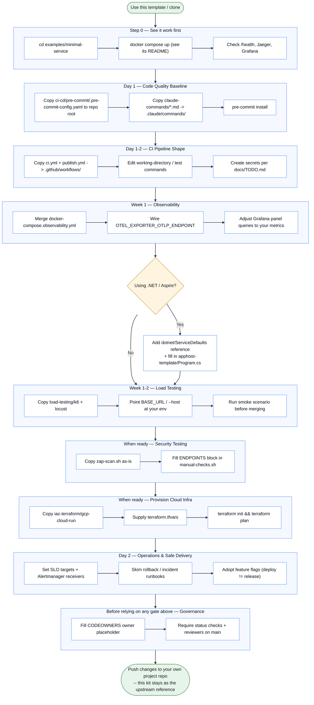

# Getting Started

A step-by-step adoption path. Each step is independent — skip what you don't
need — but they're ordered so the cheapest, highest-confidence wins come
first.



## 0. See it work first

```bash
cd examples/minimal-service
# follow examples/minimal-service/README.md — it needs `--project-directory .`
# run from the repo root, not this directory
```

Before going further, skim [`docs/ARCHITECTURE-FIT.md`](ARCHITECTURE-FIT.md)
— it lists the signals your project is a different shape than this kit
assumes (no containers, no `/health` endpoint, already on Kubernetes,
secrets committed in source, ...) and what to fix before each step below,
not after. If your stack just differs in specific tools (different
language, CI platform, or database) rather than overall shape, see
[`docs/TECH-STACK-SWAP-GUIDE.md`](TECH-STACK-SWAP-GUIDE.md) instead.

Hit `/health`, watch a trace land in Jaeger (`:16686`) and a metric show up
in Grafana (`:3000`). This confirms every extracted piece functions before
you touch your own code.

## 1. Use this template (or clone)

Click **"Use this template"** on GitHub for a clean copy with no shared
history, or `git clone` if you just want to read it first.

**Faster path:** skip steps 2–3 below by running `tools/scaffold.py`
instead — it copies the pre-commit config, CI workflows, and whichever
capability folders you choose into a new directory with every
`your-app`/`YourApp` placeholder already replaced with your actual app
name:

```bash
python3 platform-starter-kit/tools/scaffold.py \
  --app-name my-service --output ../my-service --cloud gcp
cd ../my-service
python3 tools/doctor.py .   # confirms what's still missing — see ARCHITECTURE-FIT.md
```

It writes its own `TODO.md` in the new repo with only the placeholders it
genuinely couldn't resolve (credentials, project IDs), and runs `git init`
for you so the `.gitignore`, secrets baseline, and `make setup`/pre-commit
all work immediately. Steps 2 onward below describe what `scaffold.py` does
for you, if you'd rather do it by hand or need to understand what changed.
(Adopting by hand instead? `git init` your repo before `make setup`, since
`pre-commit install` needs a git repo.)

## 2. Day 1 — code-quality baseline

- `scaffold.py` also drops a `Makefile`, `.devcontainer/`, `.tool-versions`,
  and `.env.example` (from `dev-experience/`) at your repo root. Run
  `make help` to see the task interface. `make doctor` and `make migrations`
  work immediately; `make obs-up` needs your app's `docker-compose.yml`
  first (the observability overlay layers on top of it), and `make sync`
  needs `KIT_PATH` pointed at your kit checkout (`make sync
  KIT_PATH=../platform-starter-kit`). Fill in the `setup`/`test`/`lint`/`fmt`
  targets with your stack's commands once, and every developer and CI job
  inherits them. `cp .env.example .env` and fill in local values.
- `scaffold.py` also drops a `.gitignore` (so the `.env` you just created
  can't be committed) and a `.secrets.baseline` (so the `detect-secrets`
  pre-commit hook works on your first commit instead of erroring). If you
  adopt by hand, copy this kit's `.gitignore` and run
  `detect-secrets scan > .secrets.baseline` (or `make setup`, which does it).
- Copy `ci-cd/pre-commit/.pre-commit-config.yaml` to your repo root. Besides
  secrets/SAST/lint, it shifts **Terraform** (`fmt`/`validate`/`tfsec`) and
  the **migration-safety** check left of check-in — those hooks only fire
  when the relevant files are staged, so they're free for non-IaC repos.
- Copy `claude-commands/*.md` into your `.claude/commands/`.
- Adjust the `files:` path filters in the pre-commit config to match your tree.
- Run `pre-commit install`.

## 3. Day 1–2 — CI pipeline shape

- Copy `ci-cd/github-actions/ci.yml`, `publish.yml`, and `drift-detection.yml`
  into `.github/workflows/`.
- Edit working directories and test commands to match your stack.
- Create the GitHub secrets listed in [`docs/TODO.md`](TODO.md) for whichever
  deploy target you plan to activate.
- `ci.yml` includes two safety gates that need no setup: `golden-path-check`
  (runs `tools/doctor.py`) and `migration-safety` (runs
  `tools/check_migrations.py` — see
  [`docs/DATABASE-MIGRATIONS.md`](DATABASE-MIGRATIONS.md)). Both no-op
  gracefully if the relevant files aren't present yet.
- The `terraform-plan` job runs the `governance/policy-as-code/` Conftest
  gate **in report mode by default** (prints violations, doesn't block).
  Remove its `continue-on-error: true` to hard-gate once you trust the rules
  (see [`governance/policy-as-code/README.md`](../governance/policy-as-code/README.md)).
- `publish.yml`'s deploy jobs now health-check after deploy and
  **auto-roll-back** on failure (all four targets). `drift-detection.yml`
  runs `terraform plan` on a schedule and opens an issue when deployed infra
  diverges from code — both ship gated; enable them with cloud auth.

## 4. Week 1 — observability

```bash
docker compose -f <your-compose>.yml \
                -f observability/docker-compose.observability.yml \
                --profile observability up
```

- Wire `OTEL_EXPORTER_OTLP_ENDPOINT` (or your stack's equivalent) in your app.
- Make sure your app's compose service is named `app`, or edit
  `observability/prometheus.yml`'s scrape target.
- Adjust the Grafana dashboard panel queries to your service's metric names
  if they differ from the OTel HTTP semantic conventions.
- The overlay now includes **Alertmanager** — set real receiver values in
  `observability/alertmanager.yml` (Slack webhook / PagerDuty key) when
  you're ready to route the SLO-burn alerts somewhere. Define your actual
  targets in [`operations/SLOs.md`](../operations/SLOs.md).

## 5. .NET Aspire — local multi-service orchestration

`dotnet/` is the kit's local orchestration story: the Aspire AppHost wires
your services (and their dependencies) together for `dotnet run` locally,
with OTel/health-check defaults baked in. Deployment stays multi-cloud
(step 3) — Azure Container Apps is Aspire's native `azd` path, and AWS ECS
/ GCP Cloud Run are also supported.

- Add `dotnet/ServiceDefaults` as a project reference; call
  `builder.AddServiceDefaults()` and `app.MapDefaultEndpoints()`.
- Copy `dotnet/apphost-template`, fill in your actual services in `Program.cs`,
  and generate your own `UserSecretsId` (see the TODO comment in `AppHost.csproj`).
- To deploy, activate the `deploy-azure` job in `publish.yml` (`azd provision`
  / `azd deploy`), or one of the other cloud jobs.

## 6. Week 1–2 — load testing

- Copy `load-testing/k6` and `load-testing/locust`.
- Point `BASE_URL` / `--host` at your environment.
- Replace the worked-example endpoint paths/payloads (see the TODO header in
  each file) with your own API's.
- Run the smoke scenario before merging anything load-sensitive.

## 7. When ready for security testing

- Copy `security/zap-scan.sh` as-is.
- Copy `security/manual-checks.sh` and fill in the `ENDPOINTS` configuration
  block at the top with your own routes.

## 8. When ready to provision cloud infra

- Copy `iac-terraform/gcp-cloud-run`.
- Supply your own `terraform.tfvars` and a GCS backend block (see the
  module's own `README.md`).
- `terraform init && terraform plan`.

## 9. Day 2 — operations & safe delivery

Before you're routinely shipping to production, adopt the `operations/`
folder (copied for you by `scaffold.py`) so on-call and releases aren't
improvised under pressure:

- Set your real SLO targets in [`operations/SLOs.md`](../operations/SLOs.md)
  and confirm they match `observability/recording_rules.yml`.
- Skim the runbooks now, not during an incident:
  [`rollback.md`](../operations/runbooks/rollback.md),
  [`incident-response.md`](../operations/runbooks/incident-response.md),
  and the [`postmortem-template.md`](../operations/runbooks/postmortem-template.md).
- Adopt feature flags ([`docs/FEATURE-FLAGS.md`](FEATURE-FLAGS.md)) to
  decouple deploy from release — the highest-leverage way to make shipping
  to production low-risk.

## 10. Push your changes

Push to your own project's repo. This starter-kit repo stays as the
upstream reference to re-sync from later.

## 11. Re-syncing later

If you used `tools/scaffold.py`, your repo has a `tools/sync_check.py`
copy and a `PLATFORM-KIT.md` recording which kit commit you started from.
Periodically run:

```bash
python3 tools/sync_check.py . --kit-path /path/to/platform-starter-kit --show-diffs
```

to see what's changed upstream since then, file by file. It's a report,
not a merge tool — decide per file whether to pull a change in by hand.
If you adopted by hand instead of scaffolding, there's no recorded commit
to diff against; re-reading `docs/ASSET-CATALOG.md`'s "Findings worth
knowing about" section periodically is the manual equivalent.

## 12. Governance — branch protection & policy enforcement

Every gate above (`ci.yml`'s jobs, the `golden-path-check` and
`migration-safety` jobs, the optional Conftest step in `terraform-plan` —
see [`governance/policy-as-code/README.md`](../governance/policy-as-code/README.md))
is only a *recommendation* until GitHub is told it's required. A direct
push to `main`, or a PR merged before CI finishes, bypasses all of it.
Turn the gates into actual policy:

```bash
gh api --method PUT repos/<owner>/<repo>/branches/main/protection \
  --input - <<'JSON'
{
  "required_status_checks": {
    "strict": true,
    "contexts": [
      "Backend — lint + test",
      "Frontend — typecheck + lint + test",
      "Security scan",
      "Docker Compose build",
      "Golden-path readiness (tools/doctor.py)",
      "DB migration safety (expand/contract)"
    ]
  },
  "enforce_admins": true,
  "required_pull_request_reviews": { "required_approving_review_count": 1 },
  "restrictions": null
}
JSON
```

The `contexts` list must match each job's `name:` field in `ci.yml`
exactly — after your first CI run, copy the real names from the PR's
"Checks" tab rather than trusting the list above if you've renamed any
job. `.github/CODEOWNERS` (generated by `tools/scaffold.py`, or copy this
kit's own) makes the required reviewer something specific instead of
"anyone with write access" — fill in its `@TODO-set-your-team-or-handle`
placeholder first, or the required review is satisfiable by nobody real.

## 13. Working as a team

The kit is built for more than one developer; a few pieces specifically
keep a team from stepping on each other:

- **Consistent environments** — `.devcontainer/` + `.tool-versions` pin the
  same toolchain for everyone, and the `Makefile` is the one interface
  (`make test`/`lint`/`run`) so commands don't vary per laptop. New hires
  get productive without a "set up your machine" doc that rots.
- **Merge safety** — branch protection (above) makes the CI gates required;
  `.github/CODEOWNERS` auto-requests the right reviewers. For a team, map
  paths to teams in CODEOWNERS (the scaffolded file ships commented
  examples: `/iac-terraform/ @your-org/platform-team`, etc.).
- **No racing deploys** — `publish.yml` has a `concurrency:` group so two
  merges landing close together queue instead of deploying over each other;
  `ci.yml` cancels superseded runs to save runner minutes.
- **Shared infra state** — if you use `iac-terraform/`, configure the remote
  backend (`iac-terraform/gcp-cloud-run/backend.tf.example`) **before** a
  second person runs Terraform. A GCS backend locks state during `apply`;
  local state does not, and concurrent applies corrupt it.
- **Consistent line endings** — `.gitattributes` normalizes to LF so a
  mixed-OS team doesn't get CRLF/LF churn (and shell scripts keep working).
- **No surprise secrets in diffs** — `.gitignore` keeps each developer's
  `.env` local; `.secrets.baseline` + the pre-commit hook catch a credential
  before it's ever pushed for a teammate to pull.
