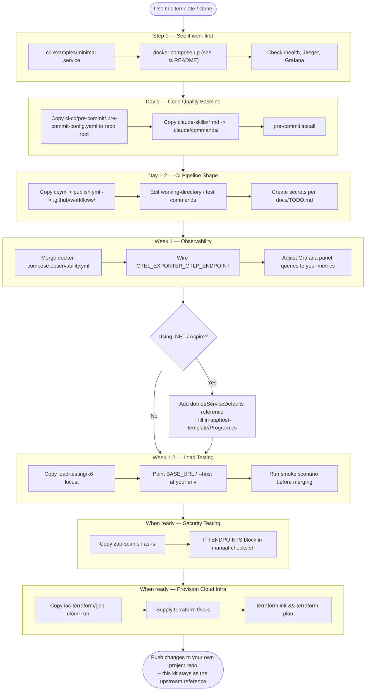

# Getting Started

A step-by-step adoption path. Each step is independent — skip what you don't
need — but they're ordered so the cheapest, highest-confidence wins come
first.



## 0. See it work first

```bash
cd examples/minimal-service
# follow examples/minimal-service/README.md — it needs `--project-directory .`
# run from the repo root, not this directory
```

Hit `/health`, watch a trace land in Jaeger (`:16686`) and a metric show up
in Grafana (`:3000`). This confirms every extracted piece functions before
you touch your own code.

## 1. Use this template (or clone)

Click **"Use this template"** on GitHub for a clean copy with no shared
history, or `git clone` if you just want to read it first.

## 2. Day 1 — code-quality baseline

- Copy `ci-cd/pre-commit/.pre-commit-config.yaml` to your repo root.
- Copy `claude-skills/*.md` into your `.claude/commands/`.
- Adjust the `files:` path filters in the pre-commit config to match your tree.
- Run `pre-commit install`.

## 3. Day 1–2 — CI pipeline shape

- Copy `ci-cd/github-actions/ci.yml` and `publish.yml` into `.github/workflows/`.
- Edit working directories and test commands to match your stack.
- Create the GitHub secrets listed in [`docs/TODO.md`](TODO.md) for whichever
  deploy target you plan to activate.

## 4. Week 1 — observability

```bash
docker compose -f <your-compose>.yml \
                -f observability/docker-compose.observability.yml \
                --profile observability up
```

- Wire `OTEL_EXPORTER_OTLP_ENDPOINT` (or your stack's equivalent) in your app.
- Make sure your app's compose service is named `app`, or edit
  `observability/prometheus.yml`'s scrape target.
- Adjust the Grafana dashboard panel queries to your service's metric names
  if they differ from the OTel HTTP semantic conventions.

## 5. If using .NET / Aspire

- Add `dotnet/ServiceDefaults` as a project reference; call
  `builder.AddServiceDefaults()` and `app.MapDefaultEndpoints()`.
- Copy `dotnet/apphost-template`, fill in your actual services in `Program.cs`,
  and generate your own `UserSecretsId` (see the TODO comment in `AppHost.csproj`).

## 6. Week 1–2 — load testing

- Copy `load-testing/k6` and `load-testing/locust`.
- Point `BASE_URL` / `--host` at your environment.
- Replace the worked-example endpoint paths/payloads (see the TODO header in
  each file) with your own API's.
- Run the smoke scenario before merging anything load-sensitive.

## 7. When ready for security testing

- Copy `security/zap-scan.sh` as-is.
- Copy `security/manual-checks.sh` and fill in the `ENDPOINTS` configuration
  block at the top with your own routes.

## 8. When ready to provision cloud infra

- Copy `iac-terraform/gcp-cloud-run`.
- Supply your own `terraform.tfvars` and a GCS backend block (see the
  module's own `README.md`).
- `terraform init && terraform plan`.

## 9. Push your changes

Push to your own project's repo. This starter-kit repo stays as the
upstream reference to re-sync from later.
